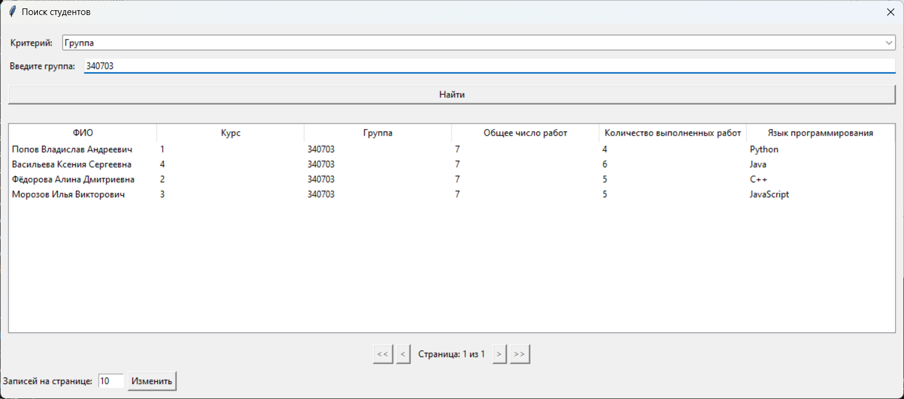
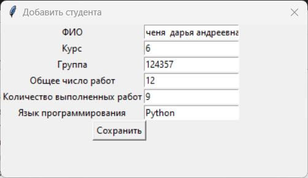

# Система учёта студентов

Система позволяет обрабатывать и представлять в удобном формате данные о студентах.

---

## Архитектура приложения

### Модель

Отвечает за данные и бизнес-логику.  
Включает классы для хранения данных о студентах (ФИО, курс, группа, количество работ и т.д.).

Реализует методы для:  
- добавления, удаления и поиска записей;  
- сохранения и загрузки данных в/из XML-файла;  
- валидации данных.  

### Контроллер

Управляет взаимодействием между Моделью и Представлением.  
Обрабатывает пользовательский ввод и ошибки, произошедшие во время выполнения программы.

### Представление

Отвечает за отображение данных пользователю и обработку пользовательского ввода.  

Включает:  
- Главное окно для отображения текущего массива записей.  
- Диалоговые окна для:  
  - добавления новой записи;  
  - поиска записей;  
  - удаления записей;  
  - сохранения данных;  
  - загрузки данных.  
  
---  

## Сценарии демонстрации

### Основные сценарии

#### 1. Добавление нового студента
**Шаги:**
1. Главное окно -> кнопка "Добавить"
2. Заполнить все поля в диалоговом окне
3. Нажать "Сохранить"

**Ожидаемый результат:**
- Новая запись появляется в таблице
- Системное сообщение об успешном добавлении

#### 2. Поиск студентов
**Варианты поиска:**
- По ФИО
- По номеру курса
- По группе
- По языку программирования
- По количеству работ

**Шаги:**
1. Главное окно -> кнопка "Поиск"
2. Выбрать критерий из выпадающего списка
3. Ввести значение для поиска или выбрать значение из выпадающего списка
4. Нажать "Найти"

#### 3. Удаление студентов
**Шаги:**
1. Главное окно -> кнопка "Удалить"
2. Выбрать критерий удаления
3. Ввести значение
4. Подтвердить удаление

### Работа с файлами

#### 1. Сохранение данных
**Шаги:**
1. Главное окно -> кнопка "Сохранить"

При необходимости:
2. Выбрать место сохранения
3. Указать имя файла (например, "students.xml")
4. Подтвердить сохранение

#### 2. Загрузка данных
**Шаги:**
1. Главное окно -> кнопка "Загрузить"
2. Выбрать XML-файл с данными
3. Подтвердить открытие

### Дополнительные сценарии

**Примеры ошибочных сценариев:**
1. Попытка добавить студента с пустым полем:
   

2. Попытка добавить студента с количеством выполненных работ больше общего количества работ:
   

3. Попытка добавить студента с некорректным форматом ФИО (менее 3 слов):
   

4. Попытка добавить студента с некорректным номером курса:
   

---

## Классы

### StudentController

Класс, представляющий контроллер, который управляет взаимодействием Модели и Представления.

**Атрибуты**:  
- `_model`: Модель, которая выполняет бизнес-логику.  
- `_view`: Представление, ответственное за визуализацию данных.  
- `_current_file_path`: Путь к файлу, который был открыт при загрузке данных.  

**Методы**:  
- `add_student(self, student_data: Dict[str, str]) -> bool`:  
  Добавляет нового студента. В случае успеха выводит сообщение об успешном добавлении, в случае ошибки — сообщение об ошибке. Возвращает `True` при успешном добавлении, иначе `False`.  

- `delete_students(self, criteria: Dict[str, str]) -> None`:  
  Удаляет студентов по заданным критериям. Выводит количество удалённых записей или сообщение, если записи не найдены. В случае ошибки выводит сообщение об ошибке.  

- `save_to_file(self) -> None`:  
  Сохраняет данные в XML-файл. Если файл не выбран, открывает диалоговое окно для выбора файла. Выводит сообщение об успешном сохранении или об ошибке.  

- `load_from_file(self) -> None`:  
  Загружает данные из XML-файла. Открывает диалоговое окно для выбора файла. Выводит сообщение об успешной загрузке или об ошибке.  

- `get_paginated_students(self, page: int, page_size: int) -> List[Student]`:  
  Возвращает список студентов для отображения на заданной странице с указанным размером страницы. В случае ошибки выводит сообщение и возвращает пустой список.  

- `get_total_students(self) -> int`:  
  Возвращает общее количество студентов в системе.  

- `get_search_results(self, criteria: Dict[str, str]) -> List[Student]`:  
  Возвращает список студентов, соответствующих заданным критериям поиска.  

- `get_unique_values(self, field: str) -> List[str]`:  
  Возвращает список уникальных значений для заданного поля (например, уникальные названия групп или курсов).  

---

### Student

Класс, представляющий данные о студенте.

**Атрибуты**:  
- `_full_name`: ФИО студента.  
- `_course`: Курс обучения.  
- `_group`: Группа студента.  
- `_total_works`: Общее количество работ.  
- `_completed_works`: Количество выполненных работ.  
- `_programming_language`: Язык программирования.  

**Методы**:  
- Геттеры для всех атрибутов (`full_name`, `course`, `group`, `total_works`, `completed_works`, `programming_language`).  
- `not_completed_works`: Возвращает количество невыполненных работ (вычисляется как разница между общим количеством работ и выполненными).  
- `__str__`: Возвращает строковое представление объекта студента.  

---

### StudentHandler

Класс для обработки XML-файлов с данными о студентах с использованием SAX-парсера.

**Атрибуты**:  
- `students`: Список для хранения данных о студентах, полученных из XML.  
- `current_student`: Текущий обрабатываемый студент.  
- `current_element`: Текущий обрабатываемый элемент XML.  

**Методы**:  
- `startElement`: Обрабатывает начало элемента XML.  
- `characters`: Обрабатывает содержимое элемента XML.  
- `endElement`: Обрабатывает конец элемента XML.  

---

### StudentRepository (абстрактный класс)

Определяет интерфейс для работы с хранилищем данных о студентах.

**Методы**:  
- `add_student`: Добавляет студента в хранилище.  
- `search_students`: Ищет студентов по заданным критериям.  
- `delete_students`: Удаляет студентов по заданным критериям.  
- `get_all_students`: Возвращает всех студентов.  
- `get_paginated_students`: Возвращает студентов для постраничного отображения.  
- `get_total_students`: Возвращает общее количество студентов.  
- `get_unique_values`: Возвращает уникальные значения для заданного поля.  

---

### InMemoryStudentRepository

Реализация `StudentRepository` для хранения данных в памяти.

**Атрибуты**:  
- `_students`: Список студентов.  

**Методы**:  
Реализует все методы абстрактного класса `StudentRepository`, включая поиск, удаление, пагинацию и получение уникальных значений.  

---

### StudentValidator (абстрактный класс)

Определяет интерфейс для валидации данных о студентах.

**Методы**:  
- `validate`: Проверяет корректность данных студента.  

---

### BasicStudentValidator

Реализация `StudentValidator` для базовой проверки данных.

**Методы**:  
- `validate`: Проверяет:  
  - Наличие всех обязательных полей.  
  - Корректность формата ФИО (ровно 3 слова).  
  - Курс должен быть от 1 до 4.  
  - Количество работ должно быть неотрицательным, а выполненных работ не может быть больше общего количества.  

---

### StudentModel

Класс, связывающий хранилище, валидатор и обработчик XML, реализующий бизнес-логику.

**Атрибуты**:  
- `_repository`: Объект для работы с хранилищем данных.  
- `_validator`: Объект для валидации данных.  

**Методы**:  
- `add_student`: Добавляет студента после валидации данных.  
- `search_students`: Ищет студентов по критериям.  
- `delete_students`: Удаляет студентов по критериям.  
- `get_paginated_students`: Возвращает студентов для постраничного отображения.  
- `get_total_students`: Возвращает общее количество студентов.  
- `get_unique_values`: Возвращает уникальные значения для поля.  
- `save_to_file`: Сохраняет данные в XML-файл.  
- `load_from_file`: Загружает данные из XML-файла.  
- `_format_fio`: Форматирует ФИО (каждое слово с заглавной буквы).  

---

### StudentView

Класс, представляющий главное окно приложения для отображения данных о студентах. Наследуется от `PaginatedView` для реализации постраничного отображения.

**Атрибуты**:  
- `_root`: Корневое окно Tkinter.  
- `_controller`: Контроллер для взаимодействия с моделью.  
- `_table`: Виджет `Treeview` для отображения данных в табличном формате.  

**Методы**:  
- `set_controller`: Устанавливает контроллер.  
- `_create_ui`: Создает пользовательский интерфейс, включая панель управления, таблицу и элементы пагинации.  
- `_create_control_frame`: Создает панель управления с кнопками для добавления, поиска, удаления, сохранения и загрузки данных.  
- `_create_table`: Настраивает таблицу для отображения данных о студентах.  
- `show_message`: Отображает информационное сообщение.  
- `show_error`: Отображает сообщение об ошибке.  
- `update_view`: Обновляет данные в таблице и элементы пагинации.  
- Обработчики кнопок:  
  - `on_add_button_clicked`: Открывает диалог добавления студента.  
  - `on_search_button_clicked`: Открывает диалог поиска студентов.  
  - `on_delete_button_clicked`: Открывает диалог удаления студентов.  
  - `on_save_button_clicked`: Сохраняет данные в файл.  
  - `on_load_button_clicked`: Загружает данные из файла.  

---

### StudentDialog (абстрактный класс)

Базовый класс для диалоговых окон. Определяет общие методы и структуру.

**Атрибуты**:  
- `_parent`: Родительское окно.  
- `_controller`: Контроллер для взаимодействия с моделью.  
- `_title`: Заголовок диалогового окна.  
- `_dialog`: Объект диалогового окна.  

**Методы**:  
- `show`: Отображает диалоговое окно.  
- `_create_widgets`: Абстрактный метод для создания виджетов (должен быть реализован в дочерних классах).  
- `_show_message`: Отображает информационное сообщение.  
- `_show_error`: Отображает сообщение об ошибке.  

---

### StudentAddDialog

Диалоговое окно для добавления нового студента.

**Методы**:  
- `_create_widgets`: Создает форму для ввода данных о студенте.  
- `_save_student`: Валидирует данные и передает их контроллеру для добавления.  

---

### StudentSearchDialog

Диалоговое окно для поиска студентов. Наследуется от `PaginatedView` для постраничного отображения результатов.

**Атрибуты**:  
- `_search_results`: Список найденных студентов.  

**Методы**:  
- `_create_widgets`: Создает интерфейс для ввода критериев поиска и отображения результатов.  
- `_create_search_controls`: Настраивает элементы управления для выбора критериев поиска.  
- `_on_criteria_select`: Обновляет интерфейс в зависимости от выбранного критерия.  
- `_perform_search`: Выполняет поиск студентов по заданным критериям.  
- `update_view`: Обновляет таблицу с результатами поиска и элементы пагинации.  

---

### StudentDeleteDialog

Диалоговое окно для удаления студентов.

**Методы**:  
- `_create_widgets`: Создает интерфейс для выбора критериев удаления.  
- `_clear_value`: Очищает поле ввода значения.  
- `_perform_delete`: Удаляет студентов по заданным критериям.  

---

### PaginatedView

Базовый класс для реализации постраничного отображения данных.

**Атрибуты**:  
- `_page_size`: Количество записей на странице.  
- `_current_page`: Текущая страница.  
- `_total_items`: Общее количество записей.  

**Методы**:  
- `_create_pagination_controls`: Создает элементы управления пагинацией (кнопки, поле ввода размера страницы).  
- `_update_pagination_controls`: Обновляет состояние элементов управления.  
- `_change_page_size`: Изменяет количество записей на странице.  
- `first_page`, `last_page`, `prev_page`, `next_page`: Методы для навигации по страницам.  
- `update_view`: Абстрактный метод для обновления данных (должен быть реализован в дочерних классах).  
- `show_error`: Абстрактный метод для отображения ошибок (должен быть реализован в дочерних классах).  
